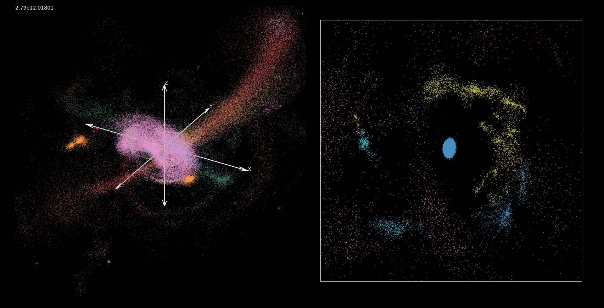

<div align="center">

# Classification and Analysis of Star-Forming Clusters in a Milky Way-Like Galaxy Simulation

**A computational pipeline for identifying and analyzing stellar structures using chemodynamical tagging.**

[](https://python.org)

📄 **[Read the full Bachelor Thesis (PDF)](docs/Samuel_Remmers_Bachelor_Thesis.pdf)**

</div>

---

## Overview

The formation and dissolution of stellar clusters are fundamental processes in galactic evolution. This repository contains the data pipeline and analytical code used to identify and evaluate these structures within a simulated galactic environment.

* **The Problem:** Identifying stellar structures—especially young clusters in a galactic disk—is notoriously difficult because purely kinematic signatures (positions and velocities) are erased within just a few orbital periods.
* **Solution:** We built a data pipeline applying two general-purpose clustering algorithms ('[AstroLink](https://github.com/william-h-oliver/astrolink)' and '[FuzzyCat](https://github.com/william-h-oliver/fuzzycat)' to a high-resolution cosmological simulation ([NIHAO-UHD](https://arxiv.org/abs/1909.05864)). We compared purely dynamical tagging against a chemodynamical approach that incorporated chemical abundances (`[Fe/H]` and `[O/H]`).
* **Result:** The chemodynamical approach proved vastly superior, identifying ~40% more clusters overall and doubling the detection rate of young, star-forming clusters in the disk. The pipeline also predicted a 4:1 ratio of native to pollution stars in a typical Milky Way-like cluster, providing a new baseline for observational studies.
---
<div align="center">
  
  <p><i>Figure 1: Animation of clusters identified by applying AstroLink and FuzzyCat to the NIHAO-UHD 2.79e12 galaxy using chemodynamical tagging</i></p>
</div>
---

## Usage

The pipeline is controlled via the `main.py` entry point. It handles loading the simulation snapshots, running AstroLink and FuzzyCat clustering, extracting chemodynamical metrics, and generating visualization plots and movies.

**Configuration**
Before running the pipeline, open `main.py` and modify the configuration variables at the top of the file to match your desired analysis parameters and local directory paths:

* `particleName`: Choose which particles to cluster (`'stars'`, `'gas'`, `'dm'`, etc.).
* `tagging`: Select the clustering methodology (`'dynamical'`, `'chemical'`, or `'chemodynamical'`).
* `first_snapshot` / `last_snapshot`: Define the range of the simulation to analyze.
* `workingDirectoryPath` & `simulationDirectoryPath`: **Update these paths** to point to where your simulation data is stored and where you want the output files saved.

*General Note*
Because this pipeline generates `.mp4` visualisations of cluster evolution over time, you must have `ffmpeg` installed on your system (in addition to the Python wrapper)

**Execution**
Once configured, simply run the main script:

```bash
python main.py
````

**Output files**
The script will generate a structured output directory containing:

* `/Clusters_raw/` & `/Clusters_iord/`: Raw .npy arrays of identified structures.

* `/Cluster_plots/`: Frame-by-frame scatter plots of the galaxy disk and identified clusters.

* `/star_cluster_analysis/`: .csv and .npy files containing median ages, metallicities, cluster masses, and contamination fractions.

* `.mp4`: A compiled movie tracking the fuzzy clusters over the lifetime of the simulation.
